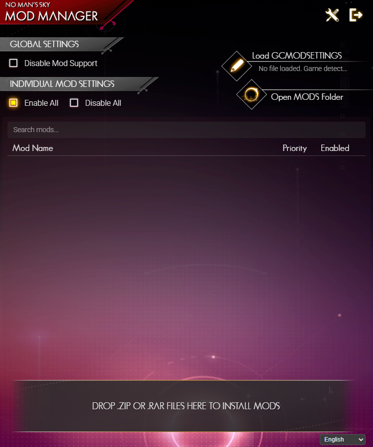
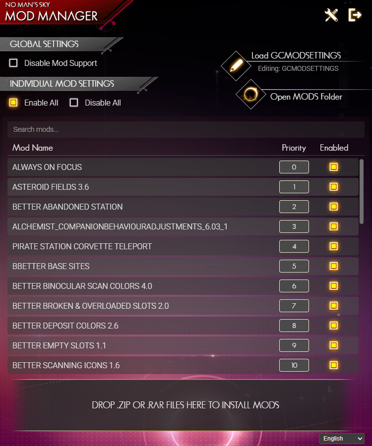
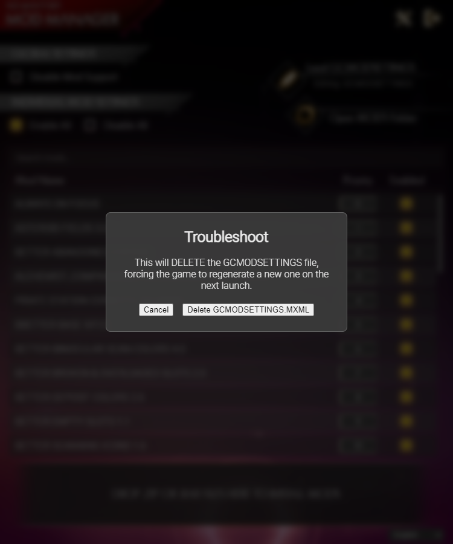

# NMS Mod Manager

A simple lightweight mod manager for No Man's Sky built with Tauri and Rust that started as a curiosity if an AI could help making it.

## Features

*   **Automatic Game Detection:** Finds your Steam or GOG installation of No Man's Sky automatically.
*   **Mod Management:** Easily enable, disable, and set the priority of your mods.
*   **Drag & Drop Installation:** Install mods by simply dropping `.zip` or `.rar` files onto the application.
*   **Troubleshooting:** Includes tools to safely reset your mod settings file.
